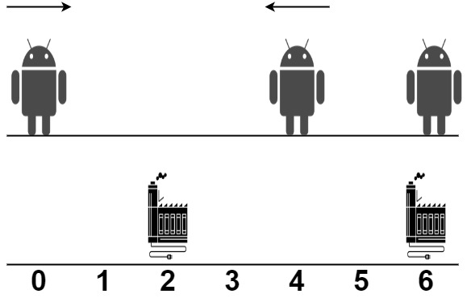

Minimum Total Distance Traveled


There are some robots and factories on the X-axis. You are given an integer array robot where robot[i] is the position of the ith robot. You are also given a 2D integer array factory where factory[j] = [positionj, limitj] indicates that positionj is the position of the jth factory and that the jth factory can repair at most limitj robots.

The positions of each robot are unique. The positions of each factory are also unique. Note that a robot can be in the same position as a factory initially.

All the robots are initially broken; they keep moving in one direction. The direction could be the negative or the positive direction of the X-axis. When a robot reaches a factory that did not reach its limit, the factory repairs the robot, and it stops moving.

At any moment, you can set the initial direction of moving for some robot. Your target is to minimize the total distance traveled by all the robots.

Return the minimum total distance traveled by all the robots. The test cases are generated such that all the robots can be repaired.

Note that

    All robots move at the same speed.
    If two robots move in the same direction, they will never collide.
    If two robots move in opposite directions and they meet at some point, they do not collide. They cross each other.
    If a robot passes by a factory that reached its limits, it crosses it as if it does not exist.
    If the robot moved from a position x to a position y, the distance it moved is |y - x|.


Solution 1: Top-down DP

dp(i,j,k) means the cost that,
to fix `robot[i]` and its following roberts
with `factory[j]` already fix k robert.

In each iteration of DP:
If i == robot.length,
means already fixed all robert,
return cost = 0.

If j == factory.length,
means no more available factory
return cost = inf.

Option 1: Skip the current factory[i], res1 = dp(i, j + 1, 0)
Option 2: Fix in the current factory[i] with cost abs(A[i] - B[j][0])
Still need to fix robert[i + 1] and other roberts,
so res2 = dp(i + 1, j, k + 1) + abs(A[i] - B[j][0])

Finally return min(res1, res2) as the result.

Complexity

Time O(nmk)
Space O(nmk)

```


```