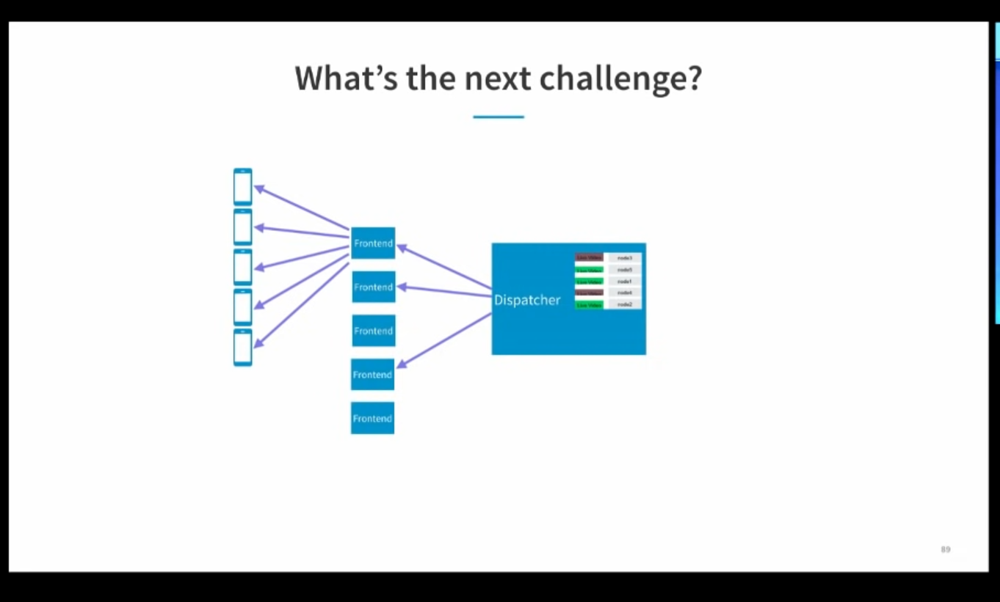
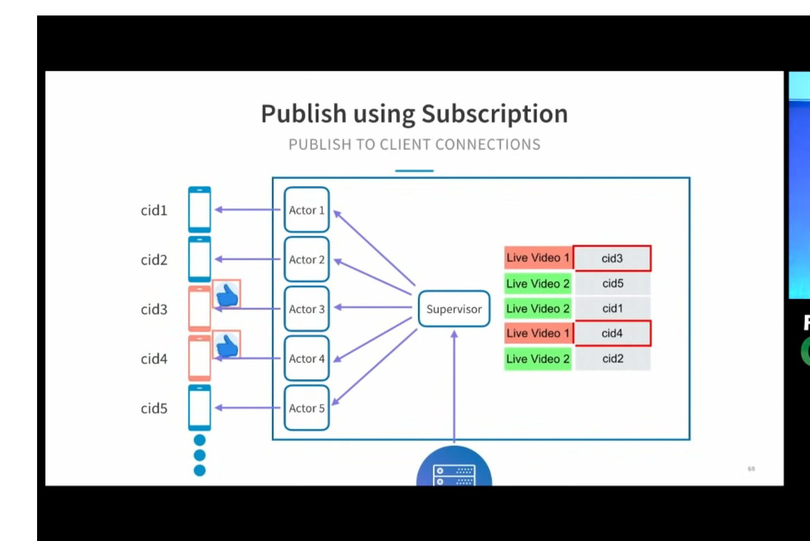

LinkedIn

- HTTP Long Poll with Server Sent Events (SSE)
- EventSource interface / API
- Challenge: Multiple Connections
- Solution: Akka and Play - Akka Actors have state and behavior, mailbox, is a thread, can have millions
- Challenge: Multiple Live Videos (clients can have multiple subscriptions)
- Solution: Need subscriptions - subscription table is in memory
- Challenge: 100 likes per second (high amount)
- Solution: multiple dispatchers - now subscriptions table can no longer be just in memory in one instance. It is pulled out into redis.
- Can also use system for likes, messaging, status (green dot)
- Publishing in cross data center fashion is better than subscribing in a cross data center fashion (publish is fanout, while subscription is local to dc)
- How many persistent connections can a single machine hold? (about 100k - because work is being done)
- So with 180 machines could have 18 million connections
- Can have 5k green nodes (the middle frontend layer makes things massively scaleable, otherwise the dispatcher would have to hold the connections itself - see green pic
- E2E latency is 75 ms
- tiny.cc/linkedinlatency - they use samza on how to measure latency across many different parts of the stack
- This system is completely horizontally scaleable
- tiny.cc/linkedinpresence
- Why not do this with Kafka? We don't care about consistency guarantees as much, so we tradeoff consistency for speed / connections. (its ok to drop a like occasionally)

- https://www.youtube.com/watch?v=yqc3PPmHvrA